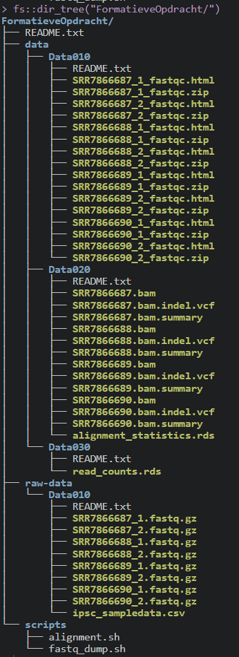

# Guerilla analytics

De Guerilla analytics principles geeft aan hoe er het best in een team bij een datascience project gewerkt kan worden. Een paar voorbeelden van deze principes zijn het goed ordenen van data, alles automatiseren met code, reproducirbaar werken en een version control gebruiken zoals Git en Github. 

Hier is het eerst genoemde principe uitgebeeld, het goed en duidelijk ordenen van data. Dit is erg belangrijk om bestanden niet kwijt te raken en een goed overzicht te houden. 


```r
knitr::include_graphics(
  here::here(
    "images",
    "Foldertree_Daur2.png"
  )
)
```

<div class="figure">

<p class="caption">(\#fig:foldertree)Folder tree, Daur2 indeling van bestanden</p>
</div>


